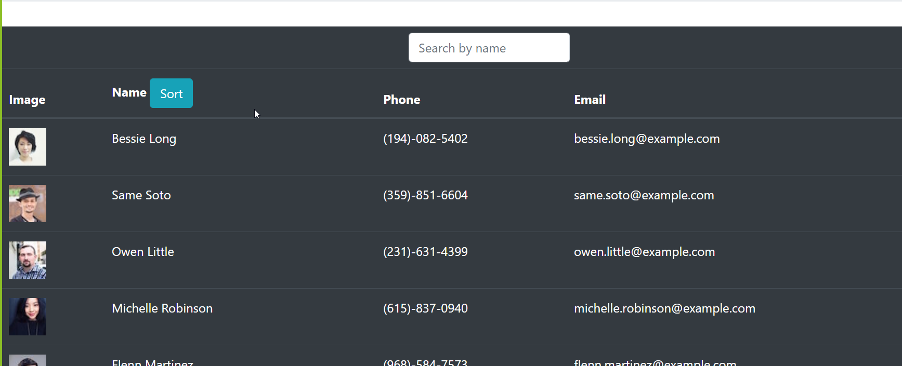

# USER DIRECTORY

# TOC
1. [ Description. ](#desc)
2. [ Tech. ](#tech)
3. [ Usage. ](#usage)
4. [ Issues. ](#issues)
5. [ Contribute. ](#contribute)
6. [ Questions/Contact. ](#questions)

## 1. Description
With this User Directory App, users are able to view their entire employee directory at once so that they can have quick access to employees' information.

## 2. Tech
* html
* css
* bootstrap
* js
* node
* axios
* react

## 3. Usage
To run this application locally, run npm install in your terminal. Run node server.js on your terminal to start the server and follow the link or open it on your browser to view the application on your computer(locally). The application running on GitHub Pages can be found [here](https://lisaaaalisa.github.io/userDirectory/) 

  

## 4. Issues
Please let me know if you find any issues with this app, thank you!

## 5. Contribute
If you wish to contribute to this app, please contact me!

## 6. Questions/Contact
Github: [LisaAAAlisa](https://github.com/LisaAAAlisa/)

Email: <alisaamacedo@gmail.com>

